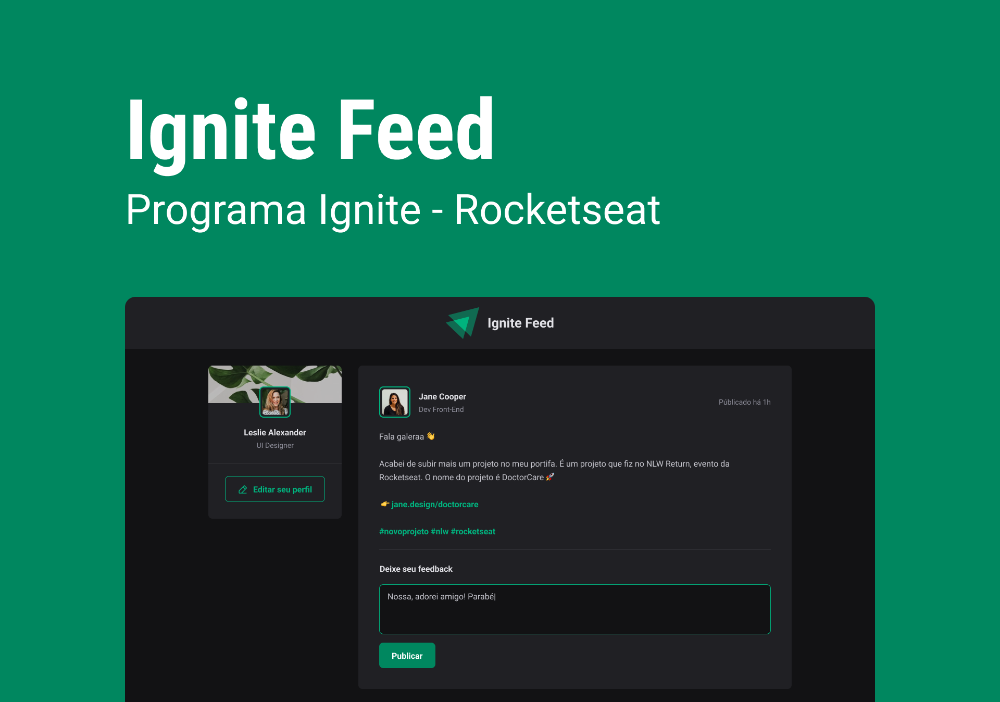

<h1 align="center">Ignite Feed</h1>

  

## 🚀 Tecnologias

Esse projeto foi desenvolvido com as seguintes tecnologias:

- React
- Vite

## 💻 Projeto

O Ignite Feed é uma rede social onde podemos fazer publicações e dar feedbacks!

## 🔖 Layout

Você pode visualizar o layout do projeto através [desse link](https://www.figma.com/community/file/1113573231685349036). É necessário ter conta no [Figma](https://figma.com) para acessá-lo.
